# BlackCat Media Client
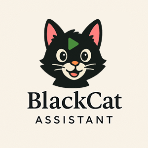

BlackCat Media 官方客户端发布仓库。  
Official release repository for BlackCat Media Client.

---

## 简介 | Overview

BlackCat Media Client 是 BlackCat Media 的官方客户端发布仓库，提供 Windows、Android 与 Android TV 版本下载，并作为统一的版本更新与发布入口。

BlackCat Media Client is the official client release repository for BlackCat Media, providing downloads for Windows, Android, and Android TV, along with centralized release notes and version history.

---

## 支持平台 | Supported Platforms

- Windows

  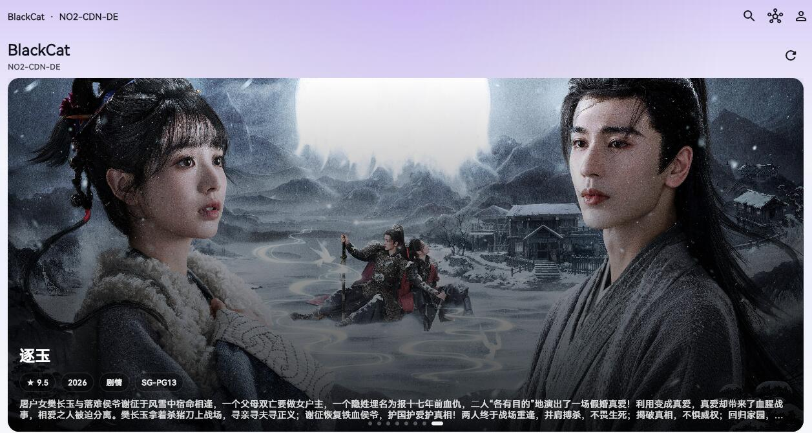
  

  

  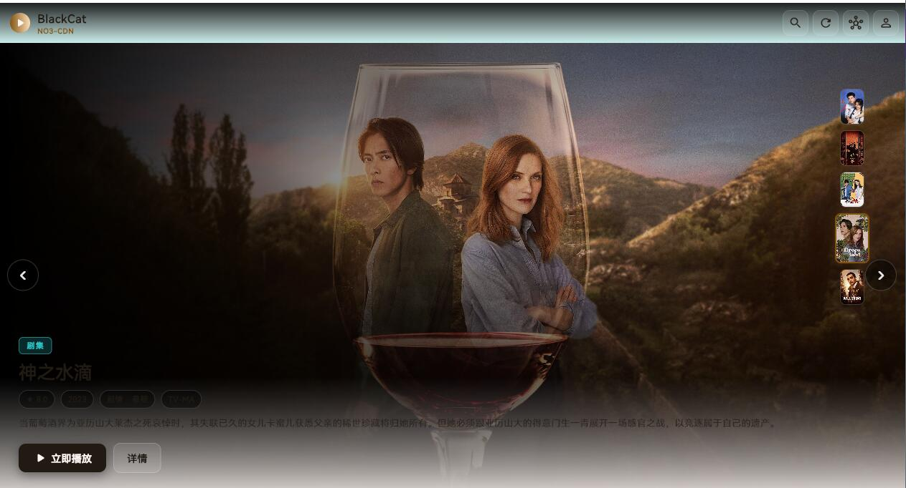
      

  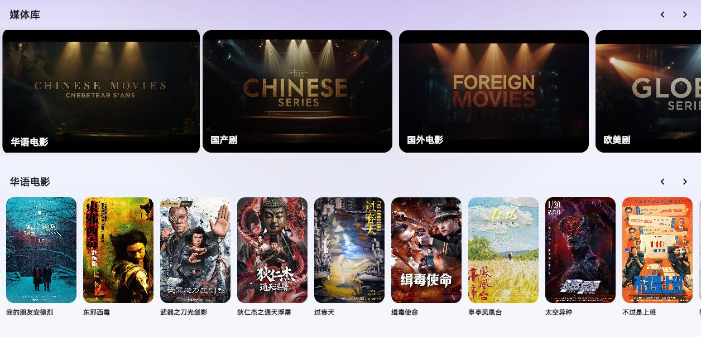
  

  

  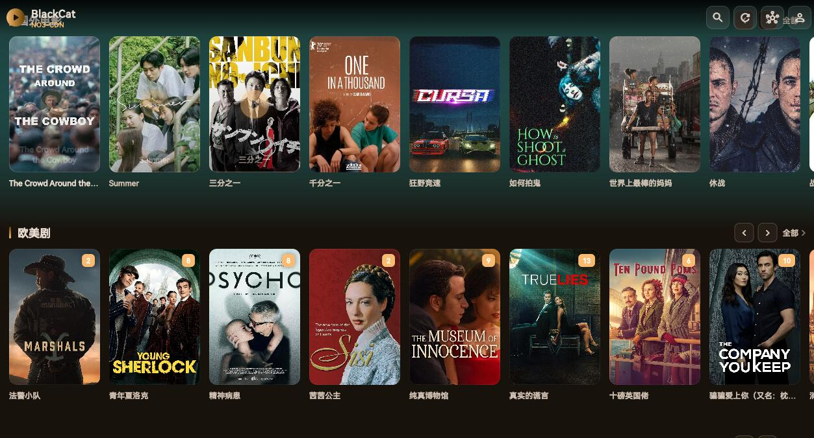

  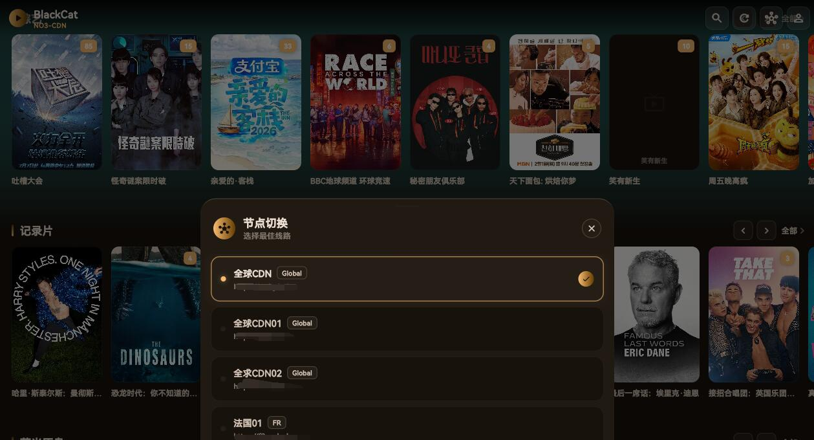
  

  

  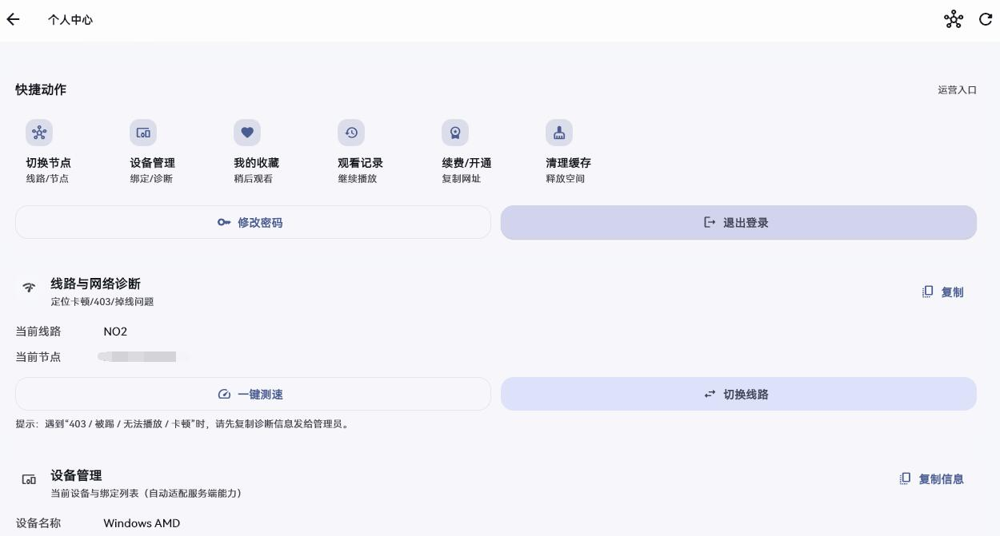
  

    

  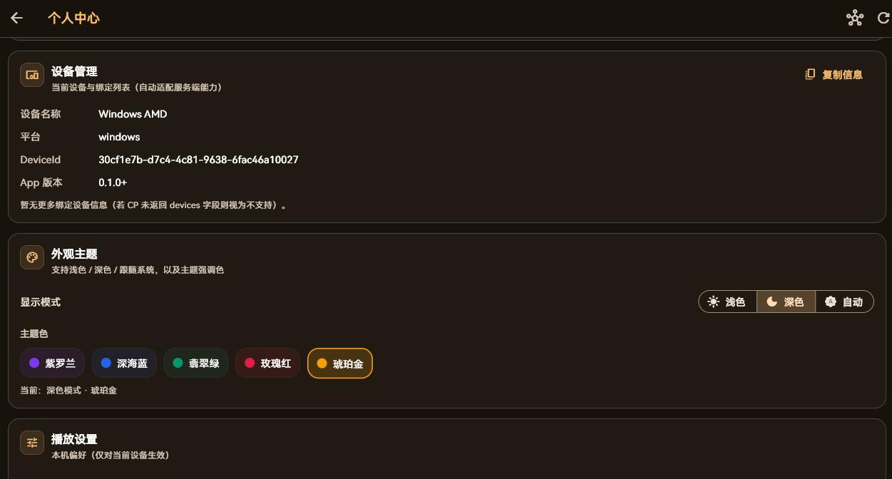
  

    

  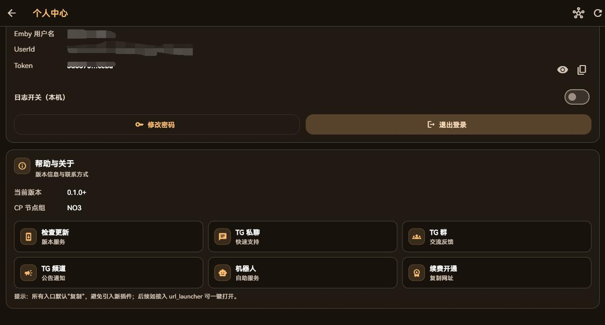
  

    

  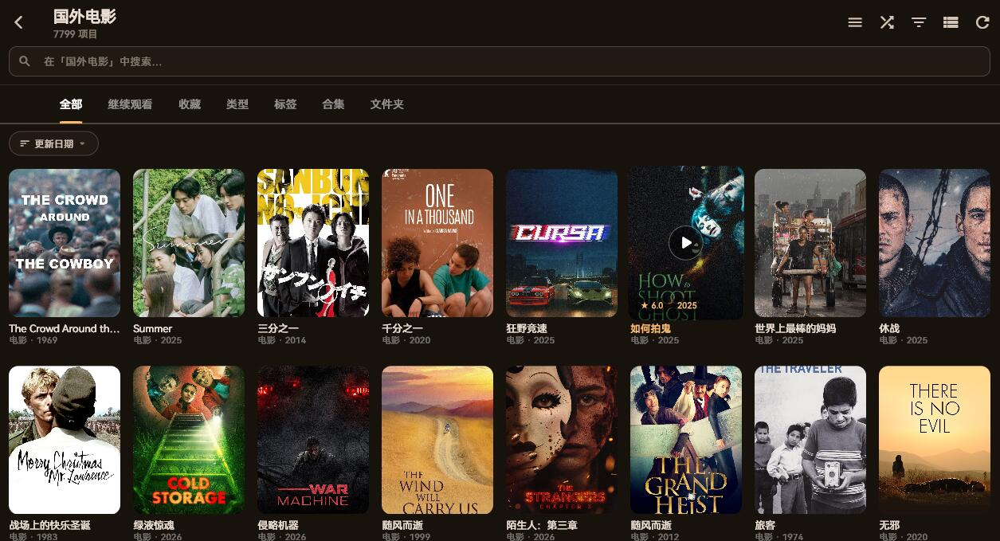
  

    

  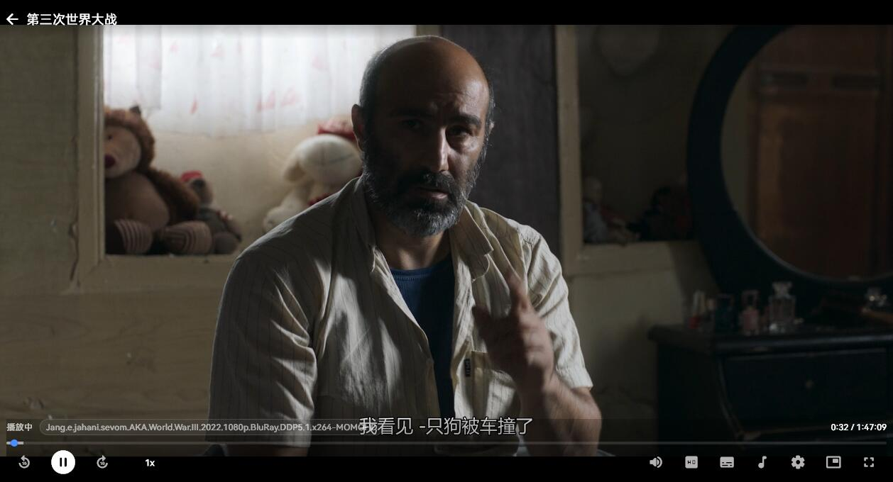
  

- Android

  
  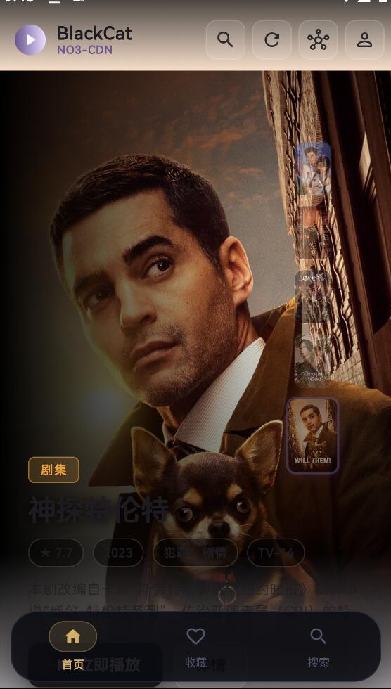
      

      

  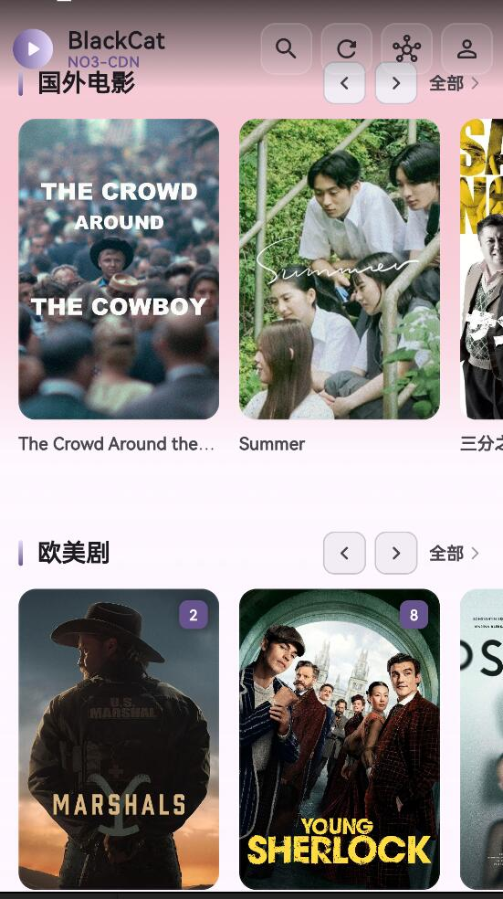
  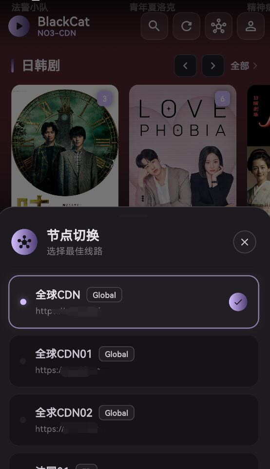
      

            

  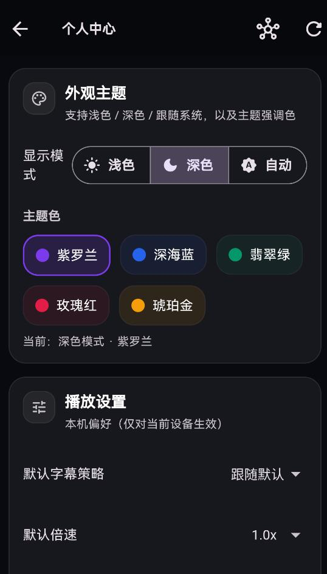
  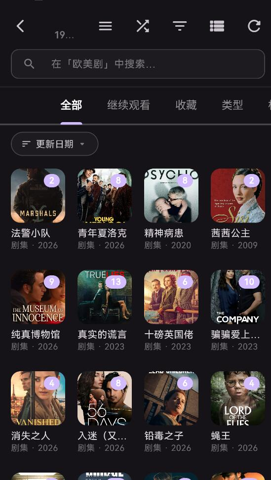
      

            

  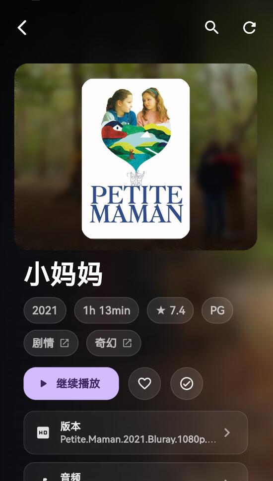
  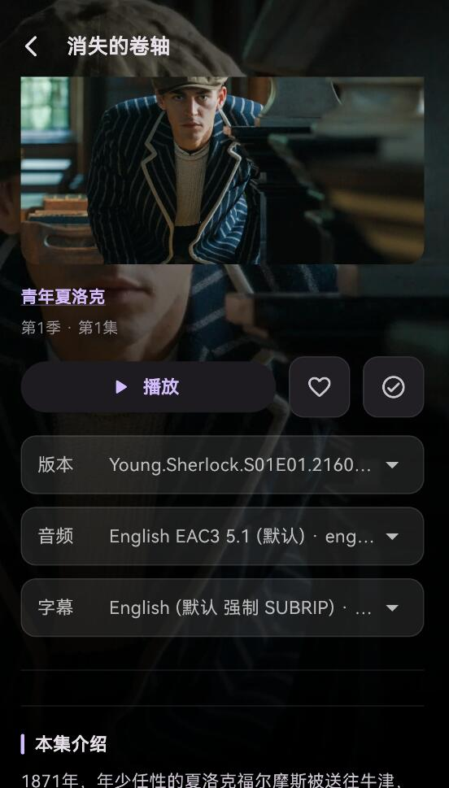
      

            

  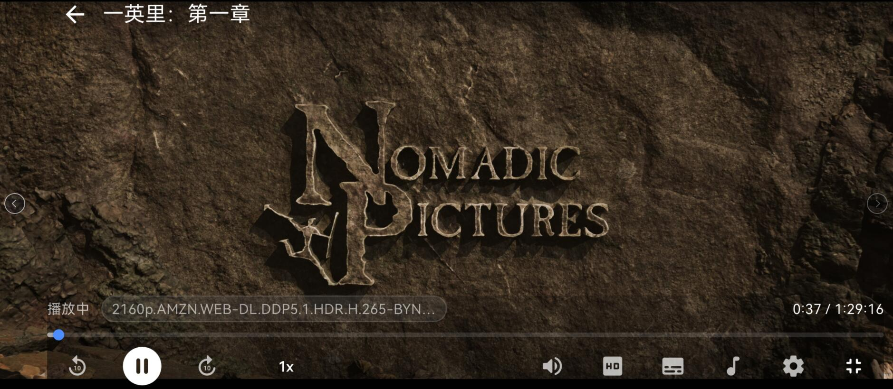
            

                        

  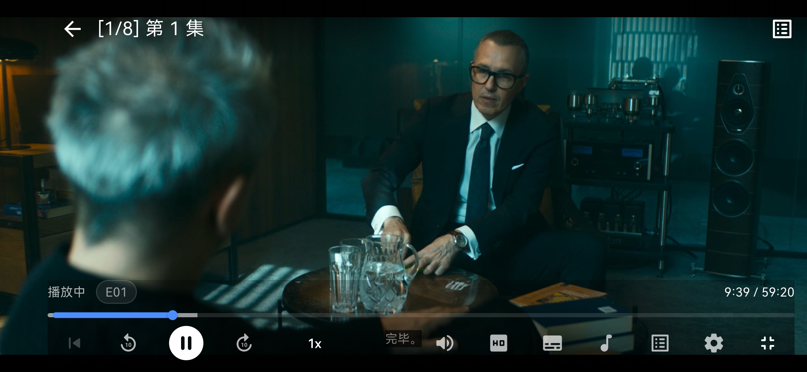
            

- Android TV

---

## 功能亮点 | Key Features

- 现代化星空深色界面 / Modern dark UI
- Apple TV 风格视觉体验 / Apple-TV inspired visual experience
- 多平台支持 / Cross-platform support
- 收藏与搜索 / Favorites and search
- 继续观看 / Continue watching
- 字幕兼容优化 / Improved subtitle compatibility
- 更稳定的播放体验 / More stable playback experience
- 节点 / 线路切换支持 / Node switching support
- 播放时自动根据地区优选最佳线路
---

## 下载 | Download

- [Latest Release](../../releases/latest)
- [Project Download Page](https://blackcatfilm.github.io/blackcat-media-client/)

---

## 说明 | Notes

该仓库为 BlackCat Media Client 的官方公开发布渠道。  
This repository can serve as the official public release channel for BlackCat Media Client.

---

## 联系方式 | Contact

你可以在这里添加：

- Official Website https://blackcatfilm.cc
- Telegram Channel https://t.me/blackcatfilm
- Blog https://b.blackcatfilm.cc
- Support Contact 
