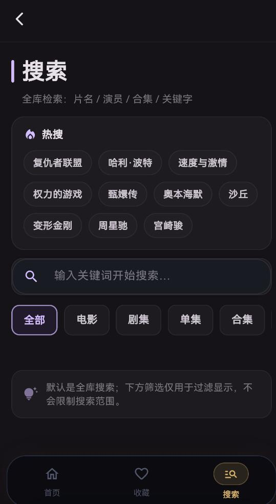
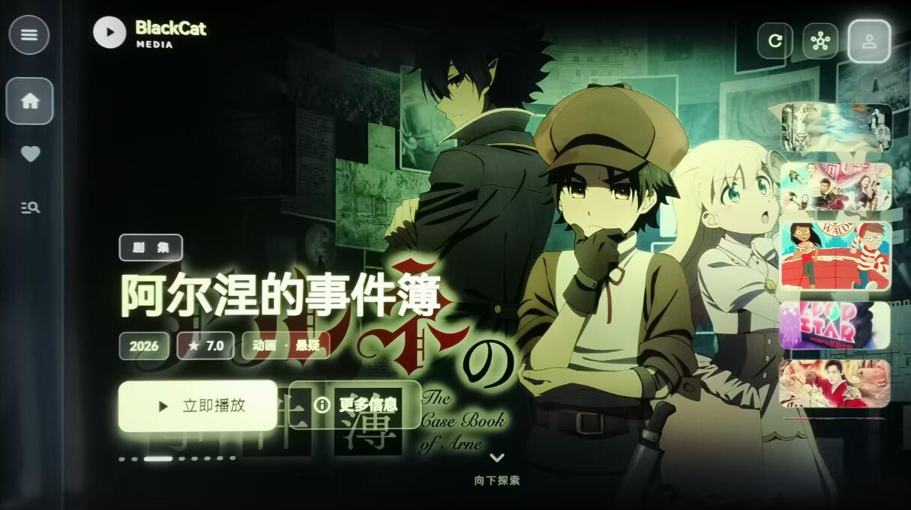
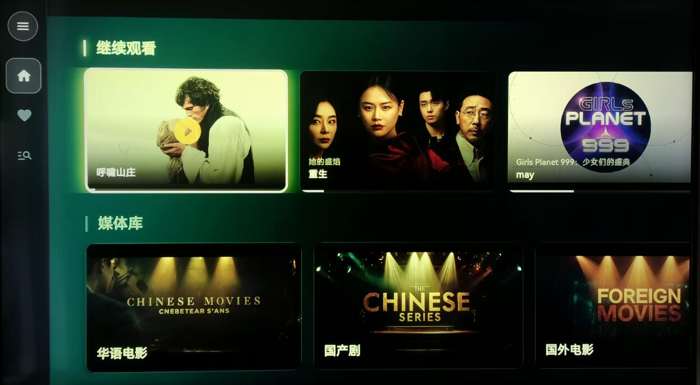
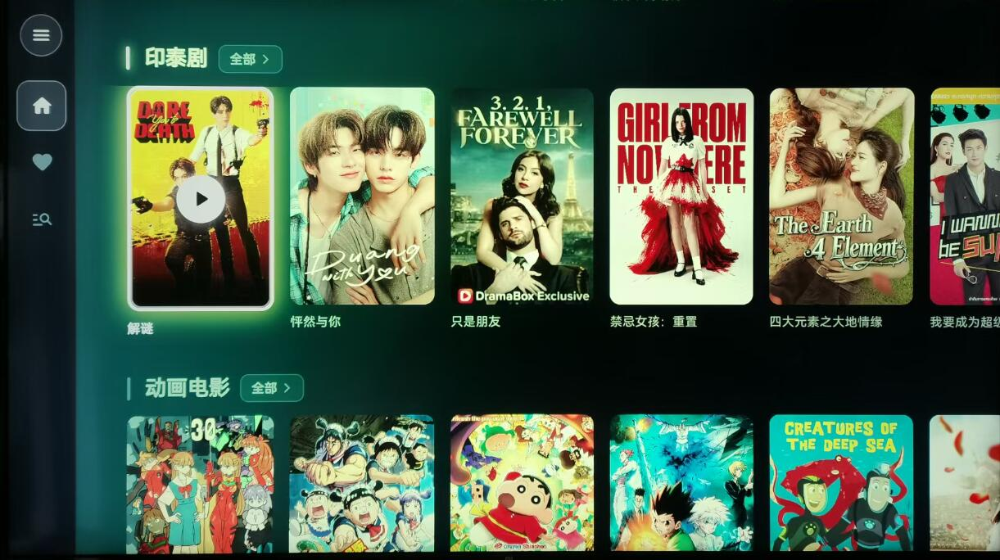
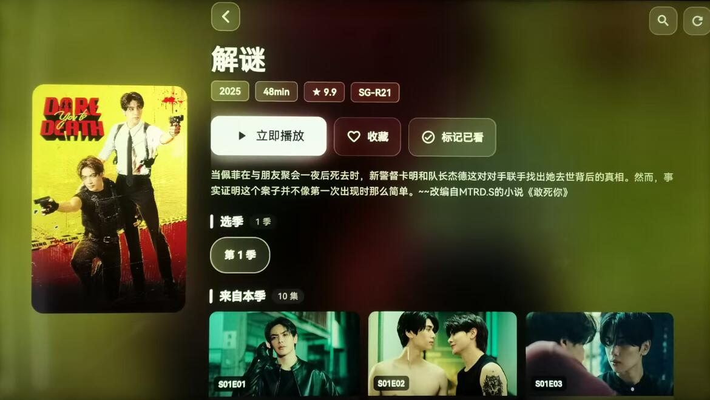
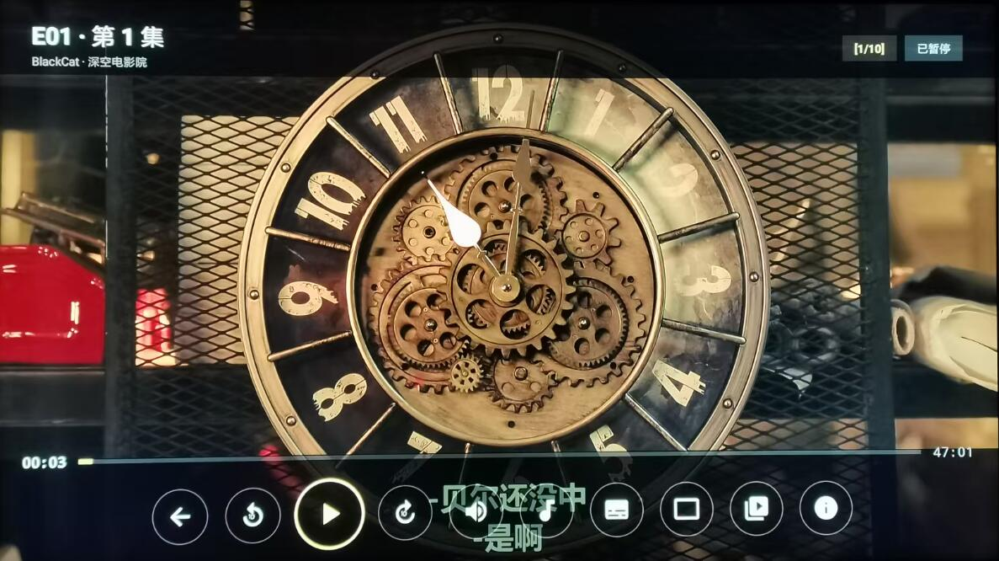
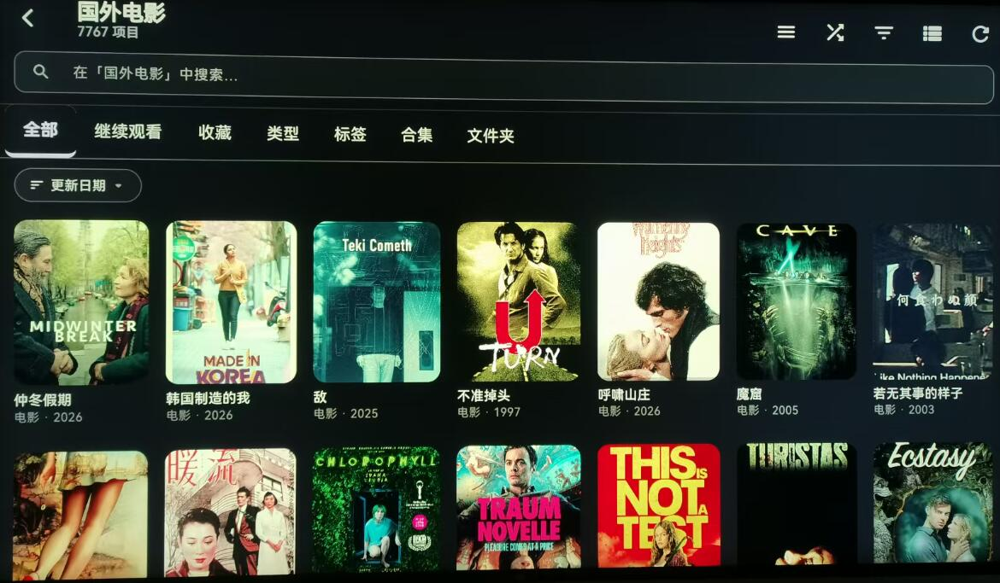
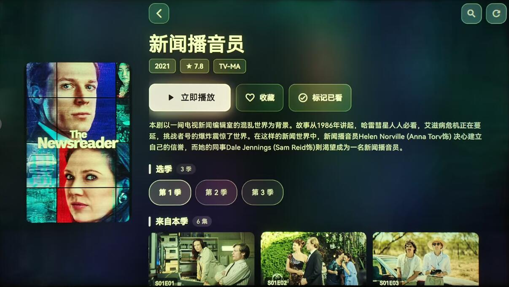
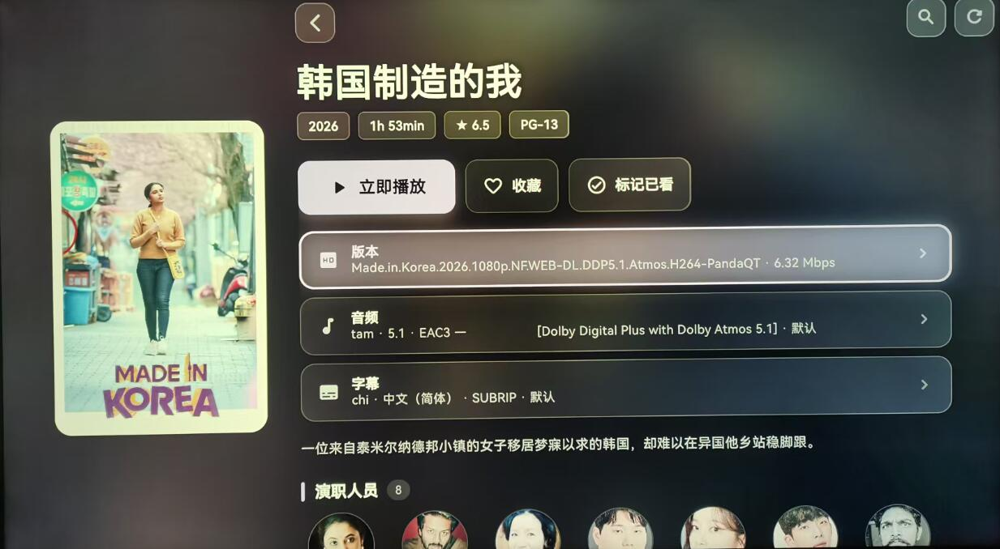

# BlackCat Media Client

BlackCat Media 官方客户端发布仓库。  
Official release repository for BlackCat Media Client.

---

## 简介 | Overview

BlackCat Media Client 是 BlackCat Media 的官方客户端发布仓库，提供 Windows、Android 与 Android TV 版本下载，并作为统一的版本更新与发布入口。

BlackCat Media Client is the official client release repository for BlackCat Media, providing downloads for Windows, Android, and Android TV, along with centralized release notes and version history.

---

<h1>🎬 BlackCat TV</h1>

<strong>专为电视体验打造的高性能 Emby 客户端</strong>

<strong>A high-performance Emby client built for real TV experience</strong>

  不只是能播，而是播得更稳、播得更顺、看得更舒服。 
  More than just playback — smoother, more stable, and more enjoyable.

<h2>✨ 核心亮点 / Highlights</h2>

<ul>
  <li>
    <strong>🔐 扫码登录 / QR Code Login</strong> 
    手机扫码即可登录 TV，无需遥控器输入复杂账号密码。 
    Scan with your phone and log in instantly on TV, no keyboard typing required.
  </li>
   
  <li>
    <strong>🎥 原生播放器优化 / Native Player Optimized</strong> 
    基于 Android 原生播放器深度优化，播放链路更稳，4K / 高码率 / 蓝光体验更好。 
    Deeply optimized native Android player for better stability with 4K, high bitrate, and Blu-ray sources.
  </li>
   
  <li>
    <strong>🌈 HDR / Dolby Vision 兼容策略 / HDR & Dolby Vision Compatibility</strong> 
    自动识别 HDR / DV 片源，针对不同设备做兼容处理，尽量避免黑屏、花屏和无画面问题。 
    Smart HDR / Dolby Vision detection with compatibility fallback strategies for different devices.
  </li>
   
  <li>
    <strong>📺 画面模式 / Screen Modes</strong> 
    支持完整显示、铺满屏幕、拉伸填充，更适合电视观影场景。 
    Supports contain, cover, and fill modes for different viewing preferences on TV.
  </li>
   
  <li>
    <strong>⚡ 首页极速加载 / Fast Home Loading</strong> 
    缓存优先，后台刷新，尽可能缩短首屏等待时间。 
    Cache-first rendering with background refresh for a much faster first screen.
  </li>
   
  <li>
    <strong>🧠 智能播放链路 / Smarter Playback Pipeline</strong> 
    减少重复请求，优化 PlaybackInfo 拉取逻辑，降低 Emby 压力并提升响应速度。 
    Reduced redundant API calls and smarter playback metadata loading for better responsiveness.
  </li>
   
  <li>
    <strong>🎨 TV 焦点与交互优化 / TV Focus & Navigation</strong> 
    遥控器焦点逻辑深度优化，更接近真正的电视端产品体验。 
    Fully optimized remote-control navigation and focus flow for a true TV-first UX.
  </li>
   
  <li>
    <strong>🔁 继续观看优化 / Continue Watching Optimized</strong> 
    修复布局跳动、晚加载错位等问题，让首页结构更稳定。 
    Improved continue-watching rail stability with better handling of delayed loading.
  </li>
   
  <li>
    <strong>🚀 启动体验 / Startup Experience</strong> 
    品牌化启动页与过渡动画，让应用更像完整产品而不是工具壳。 
    Branded splash and startup transitions for a more polished product feel.
  </li>
</ul>

<h2>🧩 平台支持 / Platforms</h2>

<ul>
  <li>📺 Android TV</li>
  <li>📱 Android</li>
  <li>💻 Desktop / Windows</li>
</ul>

<h2>🎯 项目定位 / Vision</h2>

  <strong>BlackCat TV 不只是一个普通的 Emby 客户端。</strong> 
  它更关注家庭观影体验，强调播放稳定性、交互流畅度与大屏 UI 观感。

  <strong>BlackCat TV is not just another Emby client.</strong> 
  It focuses on real home theater experience — stability, smooth navigation, and polished big-screen UI.

<h2>✅ 当前版本特点 / Current Release</h2>

<ul>
  <li>已完成核心播放链路收口</li>
  <li>扫码登录已经闭环</li>
  <li>TV UI 与焦点体验已大幅优化</li>
  <li>持续优化更多设备兼容性</li>
</ul>

<ul>
  <li>Core playback pipeline stabilized</li>
  <li>QR login fully implemented</li>
  <li>Major TV UI and focus improvements</li>
  <li>Ongoing compatibility improvements for more devices</li>
</ul>

<h3>🌟 为家庭影院体验而生 / Built for real home theater experience</h3>

  欢迎体验、反馈与建议。 
  Feedback and contributions are welcome.

## 支持平台 | Supported Platforms

- Windows

  
  

  

  
      

  
  

  

  

  
  

  

  
  

    

  
  

    

  
  

    

  
  

    

  
  

   

   
       

- Android

  
   
      

      

 
  
      

            

   
  
      

            

 
  
      

            

  
            

                        

  
            

- Android TV

  
  

  

  
      

  
  

  

  

  
  

  

  
  

    

  
  

    

  
  

---

## 功能亮点 | Key Features

- 现代化星空深色界面 / Modern dark UI
- Apple TV 风格视觉体验 / Apple-TV inspired visual experience
- 多平台支持 / Cross-platform support
- 收藏与搜索 / Favorites and search
- 继续观看 / Continue watching
- 字幕兼容优化 / Improved subtitle compatibility
- 更稳定的播放体验 / More stable playback experience
- 节点 / 线路切换支持 / Node switching support
- 播放时自动根据地区优选最佳线路
---

## 下载 | Download

- [Latest Release](../../releases/latest)
- [Project Download Page](https://blackcatfilm.github.io/blackcat-media-client/)

---

## 说明 | Notes

该仓库为 BlackCat Media Client 的官方公开发布渠道。  
This repository can serve as the official public release channel for BlackCat Media Client.

---

## 联系方式 | Contact

你可以在这里添加：

- Official Website https://blackcatfilm.cc
- Telegram Channel https://t.me/blackcatfilm
- Blog https://b.blackcatfilm.cc
- Support Contact 
